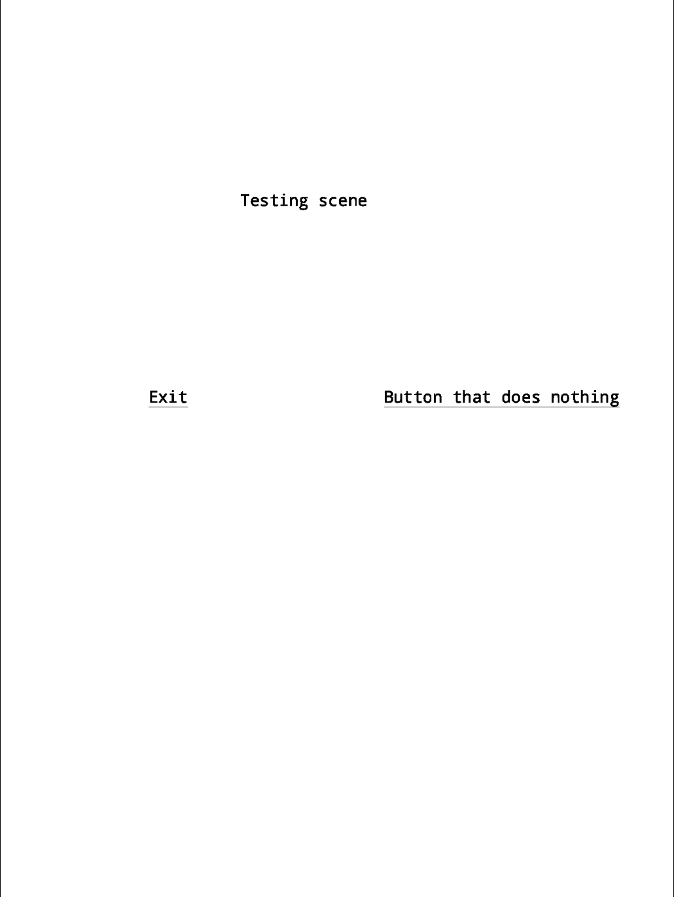

#  rm-pySAS - Python library for easy development of apps for reMarkable tablet in Python.

The goal of this library is to make it as easy as possible to create applications for reMarkable tablet using Python. 

**It works as a wrapper a wrapper around [SAS](https://rmkit.dev/apps/sas) and must be installed separately.**

All types of widgets are assumed from SAS and all have same behavior. It's good idea to read about them before using this library  [here](https://rmkit.dev/apps/sas/spec).

## Dependencies

- Simple  -  SAS (simple app script) package
- Python3
- pip

All dependencies can be install via [Toltec](https://toltec-dev.org/) with command:

```
opkg install python3 simple python3-pip
```

## Installation

### From PIP repository

- Will be added later

### Build from source

1. Download repository and enter it's directory

   ```
   $ git clone https://github.com/tenJirka/rm-pySAS.git
   $ cd rm-pySAS
   ```

2. Install building package `build`

   ```bash
   $ python3 -m pip install --upgrade build
   ```

3. Create package

   ```bash
   $ python3 -m build
   ```

   Package files will be located in `dist/` file

4. Install package

   ```bash
   $ python3 -m pip install dist/rm_pysas-*-py3-none-any.whl
   ```

## Uninstallation

```
python3 -m pip uninstall rm_pysas
```

## Examples

All examples can be found in `examples/` directory.

### Simple two buttons screen:

```python
from rm_pySAS import *

# Create object representing current scene on display
scene = Scene()

# Add text label to current scene on coordinates x = 500, y = 400, weight = 100 and height = 50
# Text of the label is "Testing scene", font size is 40 and text is alight to center
# All last three parameters are optional
scene.add(Label(500, 400, 100, 50, "Testing scene", fontSize=40, justify="center"))

# Add exit button to current scene with id=exit
# When no fontSize or justify is specified, it assume last value given from previous
# widgets or default SAS will be used.
scene.add(Button(300, 800, 100, 50 , "Exit", id="exit"))

# Create second button, that will do anything.
scene.add(Button(800, 800, 100, 50, "Button that does nothing", id="button"))

# Creating event loops tha will end only when exit button is clicked
while(True):
    scene.display()

    # scene.input represent output from SAS and is actually scripts input
    # It's list of id of widget interacted with and, if exists, value entered.

    # When exit button is pressed, the cycle will break.
    if scene.input[0] == "exit":
        break
```

On the reMarkable tablet it look like this:



## Credits

- [rmkit](https://github.com/rmkit-dev/rmkit) - reMarkable app framework on which this library stands